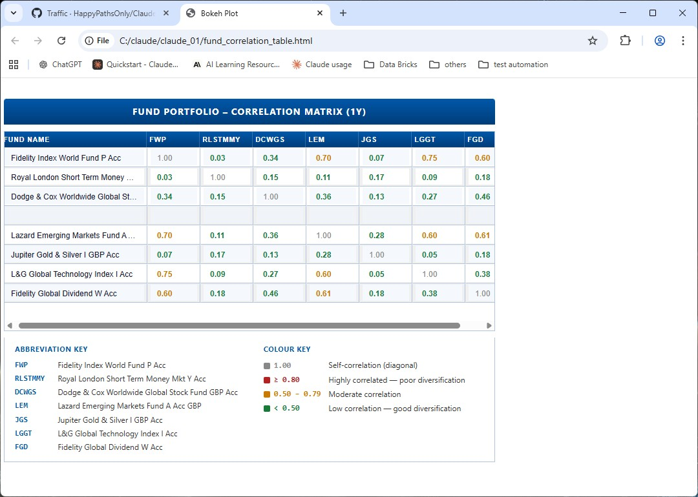
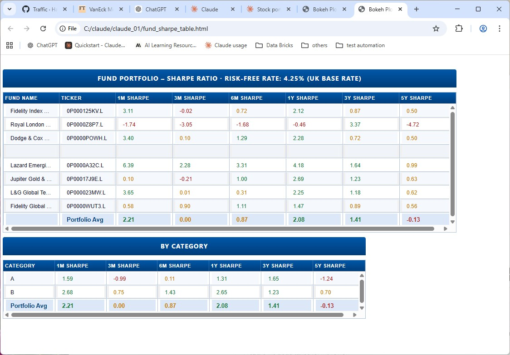
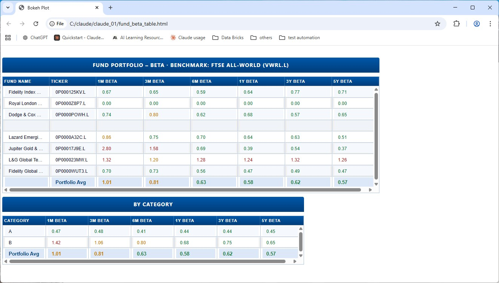
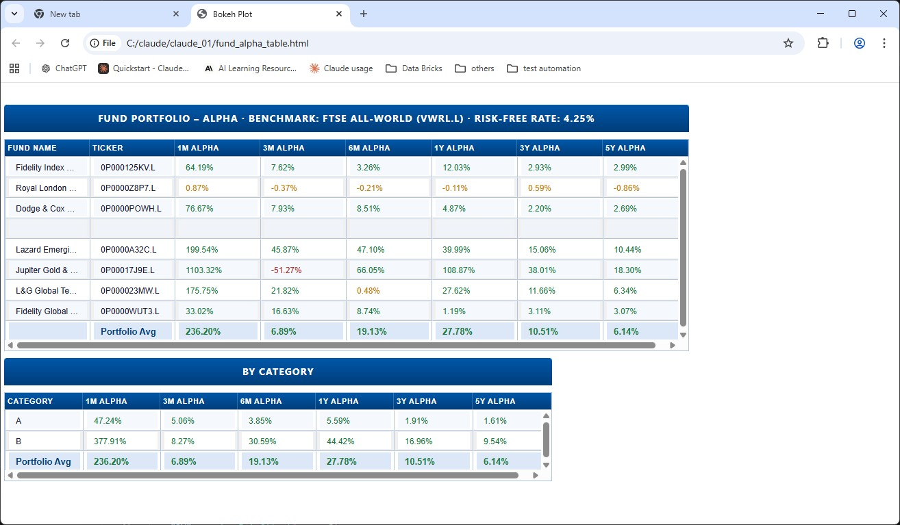

# Fund Tracker

Fund Tracker is a Python portfolio management tool that visualises your share and fund investments using live data from Yahoo Finance. Configure your holdings once in a CSV file and generate interactive browser-based tables covering current value, percentage change, historical volatility, drawdown, correlation, Sharpe ratio, beta, and alpha.

Funds are configured via a simple `funds.csv` file — no code changes are needed to add or remove holdings. Initial code is generated with Claude Code.

## Portfolio Analysis

Each view is a standalone script that fetches live pricing data and renders an interactive table in the browser. The sections below describe each view, what it measures, and how to interpret the colour coding.

---

### Fund Value

#### What is it?

The fund value table shows the absolute value (in GBP) of each holding across a series of historical snapshots: 1 year ago, 6 months ago, 1 month ago, 1 week ago, the previous day's close, and the current value. A total row summarises the whole portfolio, and a second summary table groups holdings by category.

#### Screenshot


#### Reading the table

- **Fund rows** — each row shows a single fund's value at each time point
- **Total row** — bold blue text; the sum of all holdings at each time point
- **By Category table** — groups funds by their assigned category, with a grand total row

No colour coding is applied to value figures.

---

### Fund Change

#### What is it?

The percentage change table shows how much each fund has gained or lost relative to the same historical snapshots used in the value table. This makes it straightforward to compare relative performance across funds and time horizons at a glance.

#### Screenshot


#### Reading the table

- **Green** — positive change (gain)
- **Red** — negative change (loss)
- The rightmost column shows the current absolute value for reference

---

### Fund Volatility

#### What is it?

Historical volatility (annualised) measures how much a fund's daily returns have fluctuated over a given period. Higher volatility means larger price swings — both up and down — and is commonly used as a proxy for risk. The table covers 1M, 3M, 6M, 1Y, 3Y and 5Y windows.

#### Screenshot


#### Reading the table

- **Green** — low volatility; the fund has been relatively stable
- **Amber/orange** — moderate volatility
- **Red** — high volatility; the fund has experienced large price swings
- A portfolio average row and a by-category summary table are shown below the main table

---

### Fund Drawdown

#### What is it?

Maximum drawdown measures the largest peak-to-trough decline a fund suffered during a given period, expressed as a percentage. It captures the worst-case loss an investor would have experienced if they bought at the peak and sold at the trough. The table covers 1M, 3M, 6M, 1Y, 3Y and 5Y windows.

#### Screenshot


#### Reading the table

- **Green** — small drawdown; limited peak-to-trough loss
- **Amber/orange** — moderate drawdown
- **Red** — large drawdown
- A second table below shows the date each trough occurred for every fund and time window; no colour coding is applied to dates

---

### Correlation

#### What is it?

The correlation matrix shows the Pearson correlation coefficient of daily returns between every pair of funds over a 1-year window. A value of 1.00 means two funds move in perfect lockstep; a value near 0 means they move independently; a negative value means they tend to move in opposite directions. Low correlation between funds improves portfolio diversification.

#### Screenshot



#### Reading the table

- **Grey — 1.00** — self-correlation along the diagonal; every fund perfectly correlates with itself
- **Red — ≥ 0.80** — highly correlated; these funds move together, offering poor diversification
- **Amber/orange — 0.50 to 0.79** — moderate correlation
- **Green — < 0.50** — low correlation; these funds move more independently, supporting good diversification
- An abbreviation key below the matrix maps column headers to full fund names

---

### Sharpe Ratio

#### What is it?

The Sharpe ratio measures risk-adjusted return: how much excess return a fund generates per unit of volatility, relative to the risk-free rate (UK Base Rate). A higher Sharpe ratio indicates better return per unit of risk taken. The table covers 1M, 3M, 6M, 1Y, 3Y and 5Y windows.

#### Screenshot



#### Reading the table

- **Green — ≥ 1.0** — strong risk-adjusted return
- **Amber/orange — 0 to 0.99** — moderate risk-adjusted return
- **Red — negative** — the fund returned less than the risk-free rate over that period
- A by-category summary table is shown below the main table

---

### Beta

#### What is it?

Beta measures how sensitive a fund is to movements in the broader market, benchmarked against the FTSE All-World. A beta of 1.0 means the fund moves in line with the market; below 1.0 is more defensive; above 1.0 is more aggressive. The table covers 1M, 3M, 6M, 1Y, 3Y and 5Y windows.

#### Screenshot



#### Reading the table

- **Green — < 0.8** — defensive; the fund is less sensitive to market swings
- **Amber/orange — 0.8 to 1.2** — market-like; the fund broadly tracks the market
- **Red — > 1.2 or negative** — aggressive or inverse; the fund amplifies market moves, or moves against them
- A by-category summary table is shown below the main table

---

### Alpha

#### What is it?

Jensen's Alpha measures the return a fund delivered above or below what its level of market exposure would predict, relative to the FTSE All-World and the UK Base Rate. A positive alpha means the fund outperformed its market-risk-adjusted expectation; negative alpha means it underperformed. The table covers 1M, 3M, 6M, 1Y, 3Y and 5Y windows.

#### Screenshot



#### Reading the table

- **Green** — positive alpha; the fund outperformed its market-adjusted benchmark
- **Red** — negative alpha; the fund underperformed its market-adjusted benchmark
- A by-category summary table is shown below the main table

---

## Project Structure

### Configuration

| File | Description |
|------|-------------|
| `fund_info/funds.csv` | Your local fund configuration (not committed to git) |
| `fund_info/funds.example.csv` | Example fund configuration for reference |

## Design Pattern

The project separates **what data to show** from **how to show it** using three layers:

```
Entry point  →  builds a Model  →  passes it to a Renderer
```

### 1. Models (pure data)

Each display mode has a corresponding dataclass — `TableModel`, `ValueTableModel` — that holds only the data needed for rendering: rows, headers, callbacks, etc. Models contain no GUI code and can be constructed and tested without touching any rendering backend.

### 2. Renderer abstractions (interfaces)

Each model has a paired abstract base class — `TableRenderer`, `ValueTableRenderer`, `VolatilityTableRenderer` — that declares a single `render(model)` method. These are the contracts that any rendering backend must fulfil.

### 3. Renderer implementations (GUI)

The `GUI/Bokeh/*_bokeh.py` files contain all framework-specific code. They implement the abstract renderer interfaces and are the only place that knows about the GUI framework. Adding a new backend (e.g. a terminal renderer or a web framework) requires only a new implementation file — the models and entry points remain untouched.

### Example: Alpha table

`fund_alpha_table.py` fetches prices, builds an `AlphaTableModel` (pure data — no GUI), and passes it to `BokehAlphaTableRenderer.render()`. The renderer in `GUI/Bokeh/fund_alpha_table_bokeh.py` is the only file that knows about Bokeh. The same model could be passed to a different renderer without touching the entry point or model-building logic.

### Why this structure?

- **Testability** — model-building logic can be tested independently of any GUI
- **Replaceability** — swapping the rendering backend (Qt, web, terminal) only requires a new implementation file; the models and entry points are untouched
- **Single responsibility** — data fetching, model building, and rendering each live in their own layer

## Testing

End-to-end tests are written in TypeScript using [Playwright](https://playwright.dev/) and live in `tests/e2e/`. Each test run regenerates the three Bokeh HTML files from live data before any assertions run, so the tests always reflect the current state of the code and your portfolio.

### What is tested

| Spec file | What it covers |
|-----------|----------------|
| `tests/fund_table.spec.ts` | Title bars ("Fund Portfolio", "By Category"), all 9 column headers, presence of data rows and total row in both the main and category tables |
| `tests/fund_change_table.spec.ts` | Title bar, all 9 column headers, presence of data rows and total row |

### Setup

Node.js 18+ is required. Install dependencies and the Playwright browser once:

```bash
cd tests/e2e
npm install
npx playwright install chromium
```

### Running the tests

```bash
cd tests/e2e
npm test
```

The global setup step runs `tests/e2e/generate_html.py` automatically — this fetches live data and writes the HTML files before Playwright opens them. Expect the first run to take a couple of minutes due to the network calls.

To run in headed mode (watch the browser):

```bash
npm run test:headed
```

To view the HTML report after a run:

```bash
npm run report
```

## Built With

- **Python**
- **[yfinance](https://github.com/ranaroussi/yfinance)** — fetches live pricing data from Yahoo Finance
- **[bokeh](https://docs.bokeh.org/en/latest/)** — renders interactive browser-based charts and tables
- **[Claude](https://claude.ai/)** — AI assistant used to develop this project

## Getting Started

### Prerequisites

Python 3.10+ is recommended.

Install dependencies:

```bash
pip install -r requirements.txt
```

### Running

Each entry point defaults to the Bokeh renderer (opens in the browser). Pass `--matplotlib` to use the Matplotlib renderer instead.

**Absolute value table:**

```bash
python fund_table.py
```

**Percentage change table:**

```bash
python fund_change_table.py
```

**Historical volatility table:**

```bash
python fund_volatility_table.py
```

**Max-drawdown table:**

```bash
python fund_drawdown_table.py
```

**Correlation matrix:**

```bash
python fund_correlation_table.py
```

**Sharpe ratio table:**

```bash
python fund_sharpe_table.py
```

**Beta table:**

```bash
python fund_beta_table.py
```

**Jensen's Alpha table:**

```bash
python fund_alpha_table.py
```

## Adding Funds

Copy `fund_info/funds.example.csv` to `fund_info/funds.csv` and add one row per fund. The file requires the following columns:

| Column | Description |
|--------|-------------|
| `name` | Display name of the fund |
| `ticker` | Yahoo Finance ticker symbol (UK funds typically use the format `0P0000XXXX.L`) |
| `units` | Number of units held |
| `category` | Category label used to group funds (e.g. `A`, `B`) |

The `category` column is used by `fund_table.py` to display a second summary table below the main one. Each row in that table shows the combined value of all funds assigned to that category across the same time periods, with a grand total row at the bottom.

> **Important:** All funds belonging to the same category must be grouped together as consecutive rows in the CSV file. Funds with the same category label that are separated by rows from a different category will not be aggregated correctly.

`funds.csv` is excluded from version control so your personal fund data remains local.
