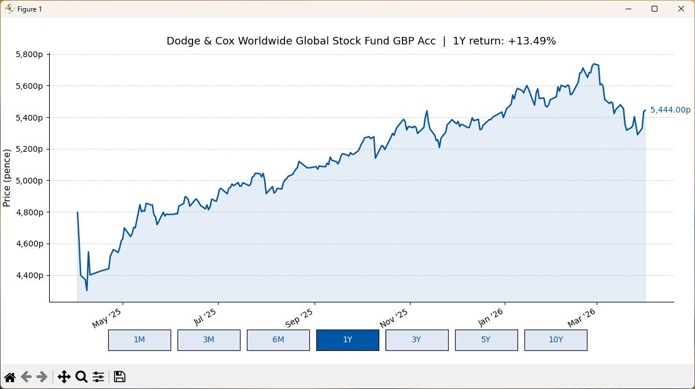
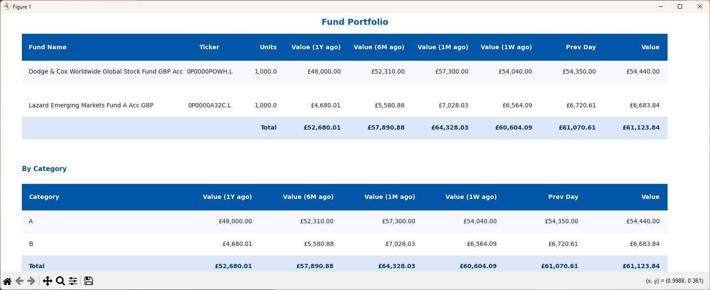
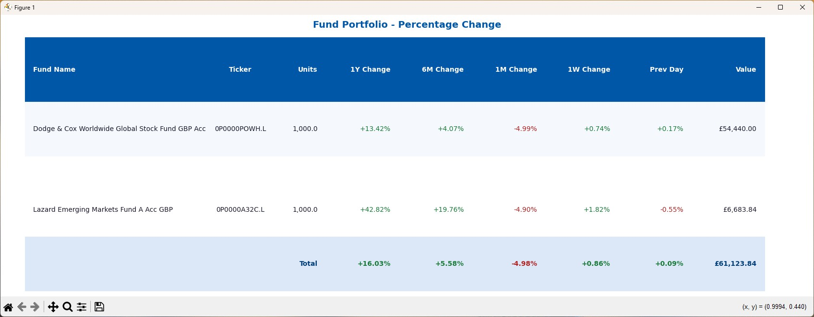

# Fund Tracker

Fund Tracker is a Python portfolio management tool that visualises your share and fund investments using live data from Yahoo Finance. Configure your holdings once in a CSV file and get instant views of your portfolio's current value, historical snapshots (1 week to 10 years back), and percentage gains/losses. Supports GBp/GBX pence-denominated instruments with automatic currency conversion.

Initial code is generated with Claude Code. 

## Overview

This project retrieves up-to-date pricing data for investment funds and displays it in three ways:

- **fund_chart.py** — interactive price chart with selectable time periods (1M to 10Y)
- **fund_table.py** — portfolio table showing fund value at previous day, 1 week, 1 month, 6 months, 1 year, and current value, with a total row and a category summary table below
- **fund_change_table.py** — portfolio table showing percentage change over the same time periods, with gains in green and losses in red

Funds are configured via a simple `funds.csv` file — no code changes needed to add or remove funds.

## Screenshots

### Fund Chart (`fund_chart.py`)


### Fund Value Table (`fund_table.py`)


### Fund Change Table (`fund_change_table.py`)


## Project Structure

The project is organised into four layers following a **model/renderer split** — see [Design Pattern](#design-pattern) below.

### Entry Points

| File | Description |
|------|-------------|
| `fund_chart.py` | Builds the chart model and launches the interactive price chart |
| `fund_table.py` | Builds the value table model and launches the absolute value table |
| `fund_change_table.py` | Builds the change table model and launches the percentage change table |

### Model / Business Logic

| File | Description |
|------|-------------|
| `fund_utils.py` | Shared data loading (`load_funds`) and price fetching (`fetch_prices_gbp`) |
| `fund_constants.py` | Shared styling and layout constants (colours, font sizes, row heights) |

### Renderer Abstractions

| File | Description |
|------|-------------|
| `fund_chart_renderer.py` | Abstract `ChartRenderer` base class and `ChartModel` dataclass |
| `fund_table_renderer.py` | Abstract `TableRenderer` base class and `TableModel` dataclass |
| `fund_value_table_renderer.py` | Abstract `ValueTableRenderer` base class and `ValueTableModel` dataclass |

### Renderer Implementations (Matplotlib)

Located in `GUI/Matplotlib/`. Each file implements the same renderer interface as its Bokeh counterpart.

| File | Description |
|------|-------------|
| `GUI/Matplotlib/fund_chart_matplotlib.py` | `MatplotlibChartRenderer` — draws the interactive line chart |
| `GUI/Matplotlib/fund_table_matplotlib.py` | `MatplotlibTableRenderer` — draws the percentage change table |
| `GUI/Matplotlib/fund_value_table_matplotlib.py` | `MatplotlibValueTableRenderer` — draws the absolute value and category summary tables |
| `GUI/Matplotlib/fund_matplotlib_utils.py` | Shared matplotlib helpers: cell drawing, column position calculation |

### Renderer Implementations (Bokeh)

Located in `GUI/Bokeh/`. Each file implements the same renderer interface as its matplotlib counterpart, so the entry points and model-building logic are untouched.

| File | Description |
|------|-------------|
| `GUI/Bokeh/fund_chart_bokeh.py` | `BokehChartRenderer` — interactive price chart with period buttons; pre-fetches all periods and switches instantly in the browser |
| `GUI/Bokeh/fund_change_table_bokeh.py` | `BokehChangeTableRenderer` — percentage change table with green/red colouring on gain/loss cells |
| `GUI/Bokeh/fund_value_table_bokeh.py` | `BokehValueTableRenderer` — absolute value table plus category summary table |

### Configuration

| File | Description |
|------|-------------|
| `funds.csv` | Your local fund configuration (not committed to git) |
| `funds.example.csv` | Example fund configuration for reference |

## Design Pattern

The project separates **what data to show** from **how to show it** using three layers:

```
Entry point  →  builds a Model  →  passes it to a Renderer
```

### 1. Models (pure data)

Each display mode has a corresponding dataclass — `ChartModel`, `TableModel`, `ValueTableModel` — that holds only the data needed for rendering: rows, headers, callbacks, etc. Models contain no GUI code and can be constructed and tested without touching matplotlib.

### 2. Renderer abstractions (interfaces)

Each model has a paired abstract base class — `ChartRenderer`, `TableRenderer`, `ValueTableRenderer` — that declares a single `render(model)` method. These are the contracts that any rendering backend must fulfil.

### 3. Renderer implementations (GUI)

The `*_matplotlib.py` files and the `GUI/Bokeh/*_bokeh.py` files contain all framework-specific code. They implement the abstract renderer interfaces and are the only place that knows about the GUI framework. Adding a new backend (e.g. a terminal renderer or a web framework) requires only a new implementation file — the models and entry points remain untouched.

### Why this structure?

- **Testability** — model-building logic can be tested independently of any GUI
- **Replaceability** — swapping matplotlib for another backend (Qt, web, terminal) only requires a new `*_renderer.py` implementation; the models and entry points are untouched
- **Single responsibility** — data fetching, model building, and rendering each live in their own layer

## Built With

- **Python**
- **[yfinance](https://github.com/ranaroussi/yfinance)** — fetches live pricing data from Yahoo Finance
- **[matplotlib](https://matplotlib.org/)** — renders charts and tables
- **[bokeh](https://docs.bokeh.org/en/latest/)** — renders interactive browser-based charts and tables
- **[Claude](https://claude.ai/)** — AI assistant used to develop this project

## Getting Started

### Prerequisites

Python 3.10+ is recommended.

Install dependencies:

```bash
pip install -r requirements.txt
```

### Running

Each entry point defaults to the matplotlib renderer. Pass `--bokeh` to open the browser-based Bokeh version instead.

**Absolute value table:**

```bash
python fund_table.py           # matplotlib
python fund_table.py --bokeh   # Bokeh (browser)
```

**Percentage change table:**

```bash
python fund_change_table.py           # matplotlib
python fund_change_table.py --bokeh   # Bokeh (browser)
```

**Interactive price chart:**

```bash
python fund_chart.py           # matplotlib
python fund_chart.py --bokeh   # Bokeh (browser, pre-fetches all periods)
```

## Adding Funds

Copy `funds.example.csv` to `funds.csv` and add one row per fund. The file requires the following columns:

| Column | Description |
|--------|-------------|
| `name` | Display name of the fund |
| `ticker` | Yahoo Finance ticker symbol (UK funds typically use the format `0P0000XXXX.L`) |
| `units` | Number of units held |
| `category` | Category label used to group funds (e.g. `A`, `B`) |

The `category` column is used by `fund_table.py` to display a second summary table below the main one. Each row in that table shows the combined value of all funds assigned to that category across the same time periods, with a grand total row at the bottom.

`funds.csv` is excluded from version control so your personal fund data remains local.
