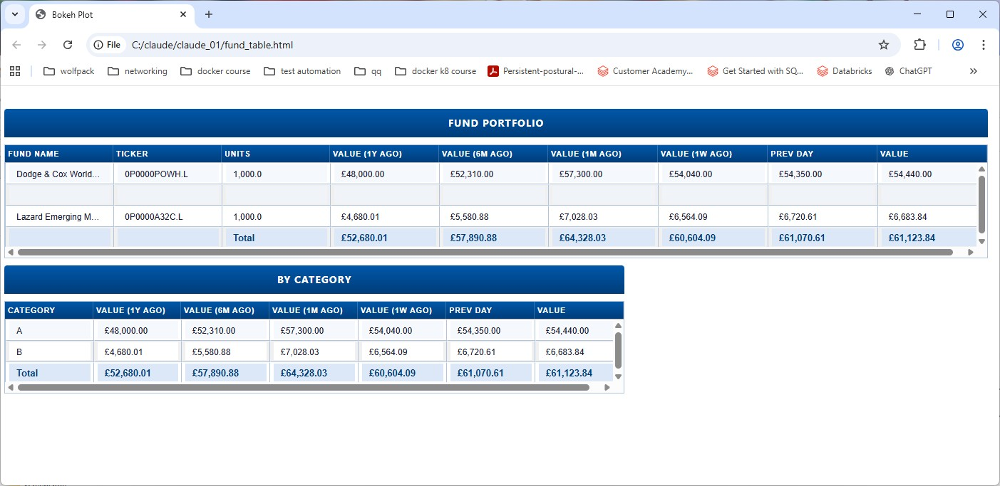
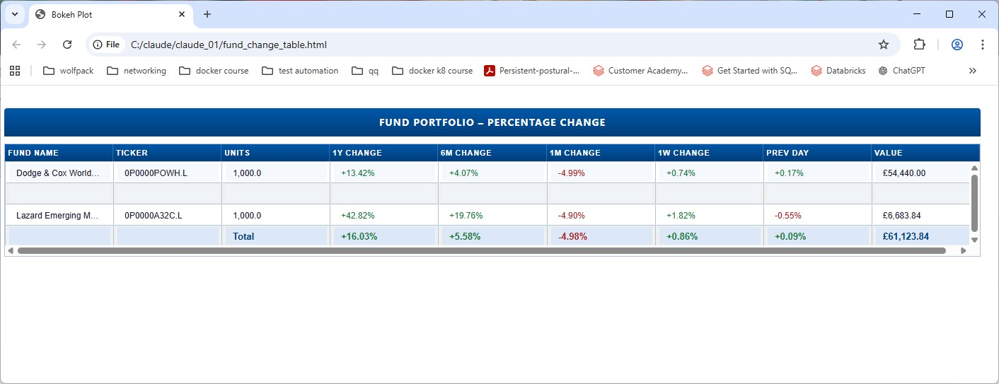
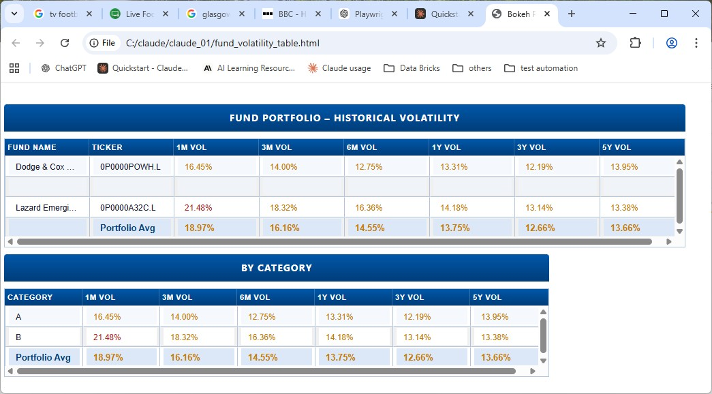
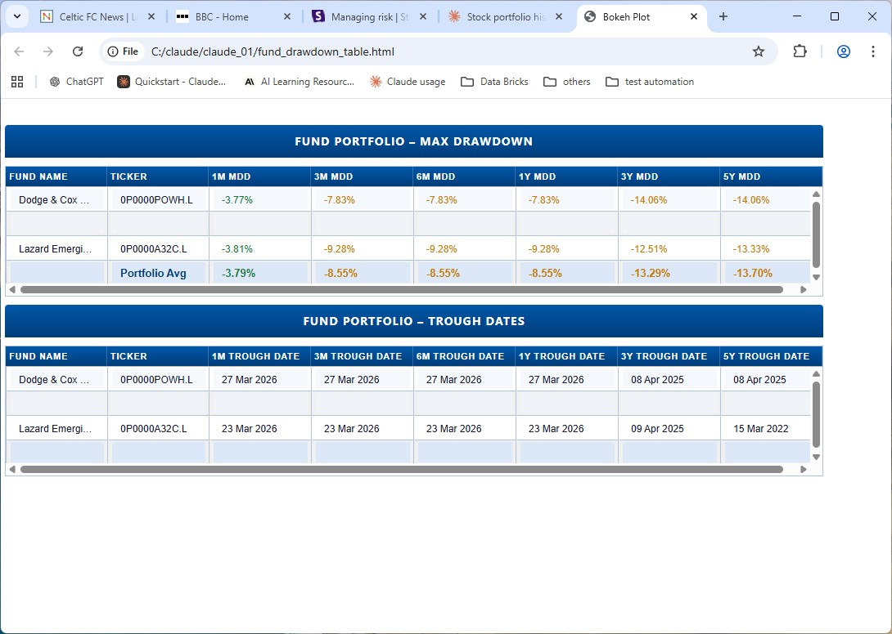

# Fund Tracker

Fund Tracker is a Python portfolio management tool that visualises your share and fund investments using live data from Yahoo Finance. Configure your holdings once in a CSV file and get instant views of your portfolio's current value, historical snapshots (1 week to 10 years back), and percentage gains/losses. Supports GBp/GBX pence-denominated instruments with automatic currency conversion.

Initial code is generated with Claude Code. 

## Overview

This project retrieves up-to-date pricing data for investment funds and displays it in four ways:

- **fund_table.py** — portfolio table showing fund value at previous day, 1 week, 1 month, 6 months, 1 year, and current value, with a total row and a category summary table below
- **fund_change_table.py** — portfolio table showing percentage change over the same time periods, with gains in green and losses in red
- **fund_volatility_table.py** — portfolio table showing annualised historical volatility over 1M, 3M, 6M, 1Y, 3Y and 5Y windows, heat-mapped from green (low) through amber to red (high)
- **fund_drawdown_table.py** — portfolio table showing the maximum peak-to-trough drawdown for each fund over 1M, 3M, 6M, 1Y, 3Y and 5Y windows, with a second table showing the date each trough occurred

Funds are configured via a simple `funds.csv` file — no code changes needed to add or remove funds.

## Screenshots

#### Fund Value Table (`fund_table.py`)


#### Fund Change Table (`fund_change_table.py`)


#### Fund Volatility Table (`fund_volatility_table.py`)


#### Fund Drawdown Table (`fund_drawdown_table.py`)


## Project Structure

The project is organised into four layers following a **model/renderer split** — see [Design Pattern](#design-pattern) below.

### Entry Points

| File | Description |
|------|-------------|
| `fund_table.py` | Builds the value table model and launches the absolute value table |
| `fund_change_table.py` | Builds the change table model and launches the percentage change table |
| `fund_volatility_table.py` | Builds the volatility table model and launches the historical volatility table |
| `fund_drawdown_table.py` | Builds the drawdown table model and launches the max-drawdown and trough-date tables |

### Model / Business Logic

| File | Description |
|------|-------------|
| `utils/fund_utils.py` | Shared data loading (`load_funds`) and price fetching (`fetch_prices_gbp`) |
| `utils/fund_constants.py` | Shared styling and layout constants (colours, font sizes, row heights) |

### Renderer Abstractions

| File | Description |
|------|-------------|
| `renderers/fund_table_renderer.py` | Abstract `TableRenderer` base class and `TableModel` dataclass |
| `renderers/fund_value_table_renderer.py` | Abstract `ValueTableRenderer` base class and `ValueTableModel` dataclass |
| `renderers/fund_volatility_table_renderer.py` | Abstract `VolatilityTableRenderer` base class and `VolatilityTableModel` dataclass |
| `renderers/fund_drawdown_table_renderer.py` | Abstract `DrawdownTableRenderer` base class and `DrawdownTableModel` dataclass |

### Renderer Implementations (Matplotlib)

A Matplotlib implementation exists in `GUI/Matplotlib/` but is not documented here.

### Renderer Implementations (Bokeh)

Located in `GUI/Bokeh/`. Each file implements the same renderer interface as its matplotlib counterpart, so the entry points and model-building logic are untouched.

| File | Description |
|------|-------------|
| `GUI/Bokeh/fund_change_table_bokeh.py` | `BokehChangeTableRenderer` — percentage change table with green/red colouring on gain/loss cells |
| `GUI/Bokeh/fund_value_table_bokeh.py` | `BokehValueTableRenderer` — absolute value table plus category summary table |
| `GUI/Bokeh/fund_volatility_table_bokeh.py` | `BokehVolatilityTableRenderer` — historical volatility table with heat-map colouring (green < 10 %, amber 10–20 %, red > 20 %) plus category summary table |
| `GUI/Bokeh/fund_drawdown_table_bokeh.py` | `BokehDrawdownTableRenderer` — max-drawdown table with heat-map colouring (green < 5 %, amber 5–20 %, red > 20 %), plus a second table showing the trough date for each fund and period |

### Configuration

| File | Description |
|------|-------------|
| `funds.csv` | Your local fund configuration (not committed to git) |
| `funds.example.csv` | Example fund configuration for reference |

## Design Pattern

The project separates **what data to show** from **how to show it** using three layers:

```
Entry point  →  builds a Model  →  passes it to a Renderer
```

### 1. Models (pure data)

Each display mode has a corresponding dataclass — `TableModel`, `ValueTableModel` — that holds only the data needed for rendering: rows, headers, callbacks, etc. Models contain no GUI code and can be constructed and tested without touching any rendering backend.

### 2. Renderer abstractions (interfaces)

Each model has a paired abstract base class — `TableRenderer`, `ValueTableRenderer`, `VolatilityTableRenderer` — that declares a single `render(model)` method. These are the contracts that any rendering backend must fulfil.

### 3. Renderer implementations (GUI)

The `GUI/Bokeh/*_bokeh.py` files contain all framework-specific code. They implement the abstract renderer interfaces and are the only place that knows about the GUI framework. Adding a new backend (e.g. a terminal renderer or a web framework) requires only a new implementation file — the models and entry points remain untouched.

### Why this structure?

- **Testability** — model-building logic can be tested independently of any GUI
- **Replaceability** — swapping the rendering backend (Qt, web, terminal) only requires a new implementation file; the models and entry points are untouched
- **Single responsibility** — data fetching, model building, and rendering each live in their own layer

## Testing

End-to-end tests are written in TypeScript using [Playwright](https://playwright.dev/) and live in `tests/e2e/`. Each test run regenerates the three Bokeh HTML files from live data before any assertions run, so the tests always reflect the current state of the code and your portfolio.

### What is tested

| Spec file | What it covers |
|-----------|----------------|
| `tests/fund_table.spec.ts` | Title bars ("Fund Portfolio", "By Category"), all 9 column headers, presence of data rows and total row in both the main and category tables |
| `tests/fund_change_table.spec.ts` | Title bar, all 9 column headers, presence of data rows and total row |

### Setup

Node.js 18+ is required. Install dependencies and the Playwright browser once:

```bash
cd tests/e2e
npm install
npx playwright install chromium
```

### Running the tests

```bash
cd tests/e2e
npm test
```

The global setup step runs `tests/e2e/generate_html.py` automatically — this fetches live data and writes the HTML files before Playwright opens them. Expect the first run to take a couple of minutes due to the network calls.

To run in headed mode (watch the browser):

```bash
npm run test:headed
```

To view the HTML report after a run:

```bash
npm run report
```

## Built With

- **Python**
- **[yfinance](https://github.com/ranaroussi/yfinance)** — fetches live pricing data from Yahoo Finance
- **[bokeh](https://docs.bokeh.org/en/latest/)** — renders interactive browser-based charts and tables
- **[Claude](https://claude.ai/)** — AI assistant used to develop this project

## Getting Started

### Prerequisites

Python 3.10+ is recommended.

Install dependencies:

```bash
pip install -r requirements.txt
```

### Running

Each entry point defaults to the Bokeh renderer (opens in the browser). Pass `--matplotlib` to use the Matplotlib renderer instead.

**Absolute value table:**

```bash
python fund_table.py
```

**Percentage change table:**

```bash
python fund_change_table.py
```

**Historical volatility table:**

```bash
python fund_volatility_table.py
```

**Max-drawdown table:**

```bash
python fund_drawdown_table.py
```

## Adding Funds

Copy `funds.example.csv` to `funds.csv` and add one row per fund. The file requires the following columns:

| Column | Description |
|--------|-------------|
| `name` | Display name of the fund |
| `ticker` | Yahoo Finance ticker symbol (UK funds typically use the format `0P0000XXXX.L`) |
| `units` | Number of units held |
| `category` | Category label used to group funds (e.g. `A`, `B`) |

The `category` column is used by `fund_table.py` to display a second summary table below the main one. Each row in that table shows the combined value of all funds assigned to that category across the same time periods, with a grand total row at the bottom.

`funds.csv` is excluded from version control so your personal fund data remains local.
